# 📄 Visualizador de Documentos - Defensoría Civil

## 🎯 Objetivo

Permitir a los operadores **visualizar los documentos** (DNI y acta de matrimonio) que los usuarios envían por WhatsApp durante la conversación con el bot.

---

## ✨ Funcionalidades Implementadas

### 1. **Galería de Documentos**
- Vista en miniatura de los documentos cargados
- Grid responsive (2 columnas en desktop, 1 en mobile)
- Hover con overlay y botón "Ver"
- Indicadores visuales de qué documentos están disponibles

### 2. **Visor de Imágenes Full-Screen**
- Modal con imagen en tamaño completo
- Controles de zoom (50%, 75%, 100%, 125%, 150%, 175%, 200%)
- Scroll para navegar la imagen con zoom
- Botón de descarga individual
- Fondo oscuro para mejor contraste

### 3. **Descarga de Documentos**
- Descarga individual desde el modal
- Nombres de archivo descriptivos (`dni_caso_1.jpg`, `acta_matrimonio_caso_1.jpg`)
- Toast de confirmación

### 4. **Estado Vacío**
- Mensaje informativo cuando no hay documentos
- Instrucciones para el usuario sobre cómo cargar documentos

---

## 🏗️ Arquitectura

### Backend (FastAPI)

#### **Nuevo Endpoint:**

```python
GET /api/cases/{case_id}/documents/{doc_type}
```

**Parámetros:**
- `case_id` (int): ID del caso
- `doc_type` (str): Tipo de documento (`dni` o `marriage_cert`)

**Response:**
- Content-Type: `image/jpeg` o `image/png`
- Body: Binary image data

**Flujo:**
1. Obtiene el caso de la BD
2. Extrae el `media_id` del campo correspondiente (`dni_image_url` o `marriage_cert_url`)
3. Descarga la imagen desde WhatsApp (WAHA)
4. Detecta el mimetype automáticamente
5. Retorna la imagen como Response binario

**Seguridad:**
- ✅ Autenticación JWT requerida
- ✅ Validación de tipo de documento
- ✅ Manejo de errores (404 si no existe, 500 si falla descarga)

#### **Endpoint Modificado:**

```python
GET /api/cases/{case_id}
```

Ahora incluye los campos:
- `dni_image_url`: ID del media del DNI
- `marriage_cert_url`: ID del media del acta de matrimonio

---

### Frontend (React + TypeScript)

#### **Nuevo Componente: `DocumentsViewer.tsx`**

**Props:**
```typescript
interface DocumentsViewerProps {
  caseId: number;
  dniImageUrl?: string | null;
  marriageCertUrl?: string | null;
}
```

**Estructura:**
```
DocumentsViewer
├── Card (Container)
│   ├── Header (Título + ícono)
│   ├── Grid de Imágenes
│   │   ├── DNI Card (con hover overlay)
│   │   └── Marriage Cert Card (con hover overlay)
│   └── Info Tip (Cómo usar el visor)
└── ImageModal (Full-screen viewer)
    ├── Header
    │   ├── Título del documento
    │   ├── Controles de Zoom
    │   ├── Botón Descargar
    │   └── Botón Cerrar
    └── Image Container (scrollable)
```

#### **Subcomponente: `ImageModal`**

**Features:**
- 🔍 Zoom de 50% a 200% en pasos de 25%
- 📥 Descarga con nombre descriptivo
- ⌨️ Cierre con botón X
- 🎨 Fondo oscuro (backdrop)
- 📱 Responsive

---

## 🎨 Diseño Visual

### Galería de Documentos

```
┌─────────────────────────────────────────┐
│ 📄 Documentación Cargada              │
├─────────────────────────────────────────┤
│ ┌──────────────┐  ┌──────────────┐    │
│ │              │  │              │    │
│ │  [DNI IMG]   │  │ [ACTA IMG]   │    │
│ │              │  │              │    │
│ └──────────────┘  └──────────────┘    │
│  📋 DNI            📋 Acta Matrimonio  │
│                                         │
│ 💡 Tip: Hacé clic para ver en tamaño  │
│    completo con zoom                   │
└─────────────────────────────────────────┘
```

### Visor Full-Screen

```
┌─────────────────────────────────────────┐
│ DNI                    [-] [100%] [+]  │
│                        [⬇ Descargar] [X]│
├─────────────────────────────────────────┤
│                                         │
│          ┌──────────────┐              │
│          │              │              │
│          │  [IMAGEN]    │              │
│          │  [AMPLIADA]  │              │
│          │              │              │
│          └──────────────┘              │
│                                         │
└─────────────────────────────────────────┘
```

---

## 📦 Integración con CaseDetail

El componente se integra en `CaseDetail.tsx`:

```tsx
<BlurFade delay={0.25}>
  <DocumentsViewer
    caseId={caseId}
    dniImageUrl={case_.dni_image_url}
    marriageCertUrl={case_.marriage_cert_url}
  />
</BlurFade>
```

**Posición:** Después de "Datos del Matrimonio", antes del "Historial de Conversación"

---

## 🔄 Flujo de Datos

```mermaid
graph LR
    A[Usuario envía foto por WhatsApp] --> B[Bot procesa con OCR]
    B --> C[Guarda media_id en BD]
    C --> D[Operador abre caso]
    D --> E[Frontend obtiene media_id]
    E --> F[Solicita imagen al backend]
    F --> G[Backend descarga de WAHA]
    G --> H[Retorna imagen al frontend]
    H --> I[Muestra en galería]
    I --> J[Usuario hace clic]
    J --> K[Abre modal full-screen]
```



---

## 🧪 Casos de Uso

### Caso 1: Caso con ambos documentos
```
Estado: ✅ DNI + ✅ Acta
Vista: Grid 2x1 con ambas imágenes
Acciones: Ver DNI, Ver Acta, Descargar cada uno
```

### Caso 2: Caso solo con DNI
```
Estado: ✅ DNI + ❌ Acta
Vista: Grid 1x1 solo con DNI
Acciones: Ver DNI, Descargar DNI
```

### Caso 3: Caso sin documentos
```
Estado: ❌ DNI + ❌ Acta
Vista: Estado vacío con mensaje informativo
Mensaje: "No hay documentos cargados aún"
Info: "El usuario puede enviar fotos por WhatsApp"
```

---

## 🎯 Beneficios

### Para Operadores:
- ✅ **Visualización rápida** de documentos enviados
- ✅ **Zoom y navegación** para verificar detalles
- ✅ **Descarga individual** para archivo local
- ✅ **Vista clara** de qué documentos faltan

### Para el Sistema:
- ✅ **No almacena imágenes** en el servidor (usa WAHA)
- ✅ **Descarga on-demand** solo cuando se necesita
- ✅ **Detección automática** de mimetype
- ✅ **Manejo de errores** robusto

---

## 🔒 Seguridad

### Backend:
- ✅ Autenticación JWT en todos los endpoints
- ✅ Validación de `case_id` y `doc_type`
- ✅ Solo descarga desde WAHA autorizado
- ✅ No expone media_id directamente al frontend

### Frontend:
- ✅ URLs relativas (no absolutas)
- ✅ Headers de autenticación automáticos
- ✅ Manejo de errores con toasts
- ✅ Cleanup de blob URLs

---

## 📊 Performance

### Optimizaciones:
- **Lazy loading:** Imágenes solo se cargan cuando se abre el caso
- **Thumbnails:** Las miniaturas usan la misma URL (navegador hace cache)
- **On-demand:** Solo descarga desde WAHA cuando se solicita
- **Blob URLs:** Se liberan automáticamente al cerrar modal

### Métricas Esperadas:
- Tiempo de carga inicial: **< 1s** (miniatura)
- Tiempo de apertura modal: **< 100ms** (usa cache)
- Tamaño promedio imagen: **200-500 KB** (JPEG comprimido)

---

## 🐛 Manejo de Errores

### Escenarios:

**1. Imagen no encontrada en WAHA:**
```
Error: 404 - "No se encontró dni para este caso"
Acción: Toast de error al usuario
Fallback: Muestra estado vacío
```

**2. Error de descarga desde WAHA:**
```
Error: 500 - "Error al descargar documento"
Logging: Backend registra el error completo
Acción: Toast de error al usuario
```

**3. Campo media_id es null:**
```
Backend: Retorna 404
Frontend: No muestra el documento en la galería
Estado: Muestra solo los documentos disponibles
```

---

## 🚀 Próximas Mejoras

### Corto Plazo:
- [ ] Agregar botón "Solicitar documento" (envía WhatsApp pidiendo el documento)
- [ ] Indicador de calidad de imagen (borrosa, clara, etc.)
- [ ] Vista comparativa lado a lado (DNI + Acta)

### Mediano Plazo:
- [ ] Rotación de imagen (90°, 180°, 270°)
- [ ] Anotaciones sobre la imagen (marcadores, comentarios)
- [ ] Historial de versiones (si el usuario envía varias fotos)
- [ ] Validación automática de calidad (nitidez, iluminación)

### Largo Plazo:
- [ ] OCR manual desde el visor (re-extraer datos)
- [ ] Comparación automática: datos extraídos vs visuales
- [ ] Reconocimiento facial para verificar identidad
- [ ] Integración con sistema de archivo digital

---

## 📝 Archivos Modificados/Creados

```
backend/
  src/presentation/api/routes/cases.py
    + GET /api/cases/{case_id}/documents/{doc_type}  [NUEVO]
    * GET /api/cases/{case_id}                       [MODIFICADO]

frontend/
  src/features/cases/
    api/cases.api.ts
      + getDocumentUrl()                             [NUEVO]
    
    types/case.types.ts
      * CaseDetail interface                         [MODIFICADO]
        + dni_image_url?: string | null
        + marriage_cert_url?: string | null
    
    components/
      DocumentsViewer.tsx                            [NUEVO - 228 líneas]
      CaseDetail.tsx                                 [MODIFICADO]
        + import DocumentsViewer
        + <DocumentsViewer /> component
```

---

## 🧪 Testing

### Manual:

```bash
# 1. Crear un caso de prueba con documentos
# (Enviar fotos por WhatsApp durante la conversación con el bot)

# 2. Abrir el caso en el dashboard
# URL: http://localhost:5173/cases/1

# 3. Scroll down hasta "Documentación Cargada"
# ✅ Deberías ver miniaturas de los documentos

# 4. Hacer clic en una miniatura
# ✅ Se abre modal full-screen

# 5. Probar controles de zoom
# ✅ Botones +/- funcionan
# ✅ Porcentaje se actualiza

# 6. Descargar documento
# ✅ Se descarga con nombre correcto
# ✅ Toast de confirmación aparece

# 7. Cerrar modal
# ✅ Modal se cierra
# ✅ Se vuelve a la vista del caso
```

### Automatizado (Futuro):
```typescript
// tests/DocumentsViewer.test.tsx
describe('DocumentsViewer', () => {
  it('shows empty state when no documents', () => {});
  it('shows DNI when available', () => {});
  it('shows marriage cert when available', () => {});
  it('opens modal on click', () => {});
  it('zooms in and out', () => {});
  it('downloads document', () => {});
});
```

---

## 💡 Tips para Operadores

1. **Ver detalles:** Usá el zoom para verificar que los datos sean legibles
2. **Descargar:** Si necesitás el documento para otro trámite, descargalo desde el modal
3. **Documentos faltantes:** Si no aparece un documento, podés contactar al usuario por WhatsApp
4. **Calidad:** Si la imagen está borrosa, pedile al usuario que envíe una nueva

---

**Última actualización:** Noviembre 2025  
**Versión:** 1.0  
**Autor:** Sistema de Defensoría Civil - Divorcios
