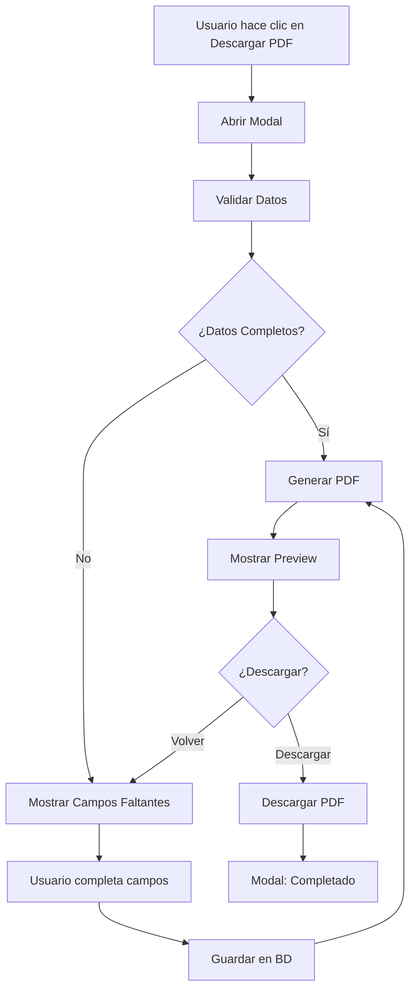

# 🚀 Mejoras Sistema de Generación de PDF - Defensoría Civil

## 📋 Resumen de Implementación

Se han implementado **mejoras completas** al sistema de generación de documentos legales, transformándolo en una experiencia interactiva y profesional para los operadores.

---

## ✨ Características Implementadas

### 1. ✅ **Validación Inteligente de Datos**

**Endpoint:** `GET /api/cases/{case_id}/validate`

**Funcionalidades:**
- Valida automáticamente todos los campos requeridos
- Calcula porcentaje de completitud
- Separa campos en: completos, faltantes y opcionales
- Retorna estructura detallada para el frontend

**Campos validados:**
- ✓ Datos personales del solicitante
- ✓ Datos del cónyuge
- ✓ Información del matrimonio
- ✓ Datos del acta matrimonial
- ✓ Información opcional (hijos, bienes)

### 2. 📝 **Edición en Línea de Campos Faltantes**

**Endpoint:** `PATCH /api/cases/{case_id}`

**Funcionalidades:**
- Permite actualizar campos específicos del caso
- Validación de campos permitidos
- Conversión automática de tipos (fechas, strings, etc.)
- Log de auditoría de campos actualizados
- Actualización de timestamp `updated_at`

**Campos editables:**
```
type, apellido, nombres, dni, cuit, domicilio, email, ocupacion, nacionalidad,
fecha_nacimiento, apellido_conyuge, nombres_conyuge, dni_conyuge, cuit_conyuge,
domicilio_conyuge, email_conyuge, ocupacion_conyuge, nacionalidad_conyuge,
fecha_nacimiento_conyuge, phone_conyuge, fecha_matrimonio, lugar_matrimonio,
fecha_separacion, acta_numero, acta_libro, acta_anio, acta_foja, acta_oficina,
tiene_hijos, info_hijos, tiene_bienes, info_bienes
```

### 3. 👁️ **Previsualización de PDF Embebida**

**Funcionalidades:**
- Visor de PDF integrado en el modal
- Navegación de páginas dentro del preview
- Zoom y scroll disponibles
- Opción de volver a editar antes de descargar
- Descarga manual desde la previsualización

### 4. 🎨 **Interfaz Mejorada con Modal Interactivo**

**Componente:** `PdfGenerationModal.tsx`

**Flujo de 5 Pasos:**

#### Paso 1: Validación 🔍
```
┌─────────────────────────────┐
│  🔄 Validando datos...     │
│  ████████░░░░░░░ 60%       │
└─────────────────────────────┘
```
- Spinner animado
- Barra de progreso
- Consulta automática al endpoint de validación

#### Paso 2: Vista de Completitud 📊
```
┌─────────────────────────────────────────┐
│ Progreso: ████████████░░░ 75%         │
│                                         │
│ ✅ Campos Completos (10)                │
│ ┌────────┬────────┐                    │
│ │ Nombre │   DNI  │ ...                │
│ └────────┴────────┘                    │
│                                         │
│ ❌ Campos Faltantes (3)                 │
│ ┌────────────────────────────┐         │
│ │ Acta Número *              │         │
│ │ [input_____________________]│         │
│ └────────────────────────────┘         │
│                                         │
│ [Cancelar] [Guardar y Generar PDF]    │
└─────────────────────────────────────────┘
```

**Características visuales:**
- 🟢 Campos completos (verde)
- 🔴 Campos faltantes (rojo) con inputs editables
- 🔵 Información opcional (azul)
- Barra de progreso de completitud
- Diseño responsive y dark mode

#### Paso 3: Guardando Datos 💾
```
┌─────────────────────────────┐
│  💾 Guardando datos...     │
│  ████████████████ 100%     │
└─────────────────────────────┘
```
- Toast de confirmación
- Llamada al endpoint PATCH
- Actualización automática del caso

#### Paso 4: Generando PDF 📄
```
┌─────────────────────────────┐
│  ⚙️ Generando PDF...        │
│  ████████████░░░ 80%       │
└─────────────────────────────┘
```
- Animación de progreso simulado
- Llamada al endpoint de generación
- Creación del blob del PDF

#### Paso 5: Previsualización 👁️
```
┌─────────────────────────────────────────┐
│ 📄 Previsualización del Documento      │
│ ┌───────────────────────────────────┐  │
│ │                                   │  │
│ │     [PDF Viewer Embebido]        │  │
│ │                                   │  │
│ │     DEMANDA DE DIVORCIO          │  │
│ │                                   │  │
│ └───────────────────────────────────┘  │
│                                         │
│ [Volver a Editar] [📥 Descargar PDF]  │
└─────────────────────────────────────────┘
```

**Características:**
- Iframe con visor de PDF nativo del navegador
- Altura fija de 500px
- Scroll y zoom disponibles
- Botón para volver a editar
- Botón para descargar definitivo

#### Paso 6: Completado ✅
```
┌─────────────────────────────┐
│         ✅                  │
│  ¡PDF Generado!            │
│  Descargado exitosamente   │
│                             │
│      [Cerrar]              │
└─────────────────────────────┘
```

---

## 🔧 Configuración Técnica

### Backend (FastAPI)

**Nuevos Endpoints:**

```python
# Validar datos del caso
GET /api/cases/{case_id}/validate
Response: {
  "case_id": int,
  "is_valid": bool,
  "complete_fields": [...],
  "missing_fields": [...],
  "optional_fields": [...],
  "completion_percentage": int
}

# Actualizar caso
PATCH /api/cases/{case_id}
Body: {
  "field_name": "value",
  ...
}
Response: {
  "message": "Caso actualizado exitosamente",
  "updated_fields": ["field1", "field2"],
  "case_id": int
}

# Generar PDF (mejorado - ahora incluye TODOS los datos)
GET /api/cases/{case_id}/petition.pdf
Response: PDF Binary (application/pdf)
```

### Frontend (React + TypeScript)

**Nuevos Componentes:**

```typescript
// Modal principal
<PdfGenerationModal 
  caseId={number}
  onClose={() => void}
/>

// API Methods
casesApi.validateCase(id: number)
casesApi.updateCase(id: number, updates: Record<string, any>)
casesApi.downloadPetition(id: number)
```

---

## 📊 Flujo de Datos Completo



---

## 🎯 Beneficios para el Usuario

### Para el Operador:
✅ **Vista clara** de qué datos faltan  
✅ **Edición rápida** sin salir del modal  
✅ **Previsualización** antes de descargar  
✅ **Feedback visual** en cada paso  
✅ **Validación automática** de datos  

### Para el Sistema:
✅ **PDFs completos** con todos los datos del bot  
✅ **Datos actualizados** en la base de datos  
✅ **Auditoría** de cambios realizados  
✅ **Mejor UX** con progreso visual  
✅ **Prevención de errores** con validación  

---

## 🧪 Casos de Prueba

### 1. Caso Completo
**Escenario:** Todos los datos recopilados por el bot  
**Resultado:** 
- Validación: 100% ✅
- Skip directo a generación
- Preview inmediato
- Descarga exitosa

### 2. Caso Incompleto (Acta faltante)
**Escenario:** Faltan datos del acta de matrimonio  
**Resultado:**
- Validación: 75% ⚠️
- Muestra 5 campos faltantes (rojo)
- Operador completa manualmente
- Guardado exitoso
- Preview y descarga

### 3. Caso Parcial (Cónyuge sin datos)
**Escenario:** Divorcio unilateral sin datos del cónyuge  
**Resultado:**
- Validación: 50% ❌
- Muestra múltiples campos faltantes
- Operador decide completar o contactar usuario
- Opción de volver sin perder progreso

---

## 🔒 Seguridad y Validación

### Backend:
- ✅ Autenticación requerida (JWT)
- ✅ Lista blanca de campos editables
- ✅ Validación de tipos de datos
- ✅ Conversión segura de fechas
- ✅ Logging de cambios

### Frontend:
- ✅ Validación de campos completos antes de guardar
- ✅ Confirmación visual de acciones
- ✅ Manejo de errores con toasts
- ✅ Cleanup de URLs de blob
- ✅ Estado local sincronizado

---

## 🚀 Próximas Mejoras Potenciales

### Corto Plazo:
- [ ] Enviar PDF por WhatsApp al usuario desde el modal
- [ ] Agregar campo de notas del operador
- [ ] Historial de PDFs generados
- [ ] Comparar versiones de documentos

### Mediano Plazo:
- [ ] Templates personalizables por tipo de divorcio
- [ ] Firma digital del operador en el PDF
- [ ] Notificaciones automáticas al usuario
- [ ] Integración con sistema de expedientes

### Largo Plazo:
- [ ] IA para sugerir datos faltantes basados en el contexto
- [ ] OCR mejorado para extraer datos de documentos escaneados
- [ ] Generación de múltiples documentos (poder, convenio, etc.)
- [ ] Dashboard de métricas de completitud de casos

---

## 📝 Notas de Desarrollo

### Tecnologías Utilizadas:
- **Backend:** FastAPI, SQLAlchemy, ReportLab, Jinja2
- **Frontend:** React, TypeScript, TanStack Query, Tailwind CSS
- **UI:** Lucide Icons, React Hot Toast, Custom Components

### Archivos Modificados:
```
backend/
  src/presentation/api/routes/cases.py  [PATCH + validate endpoints]
  
frontend/
  src/features/cases/
    api/cases.api.ts                    [Nuevos métodos]
    components/
      CaseDetail.tsx                    [Integración del modal]
      PdfGenerationModal.tsx            [Nuevo componente]
```

---

## 🎓 Guía de Uso para Operadores

### Paso a Paso:

1. **Acceder al caso**
   - Ir a "Casos" en el menú
   - Hacer clic en un caso específico

2. **Generar PDF**
   - Hacer clic en "Descargar PDF" (botón azul brillante)
   - Se abre el modal automáticamente

3. **Revisar Validación**
   - Ver barra de progreso de completitud
   - Campos en verde ✅ = OK
   - Campos en rojo ❌ = Faltantes

4. **Completar Datos Faltantes** (si aplica)
   - Ingresar datos en los campos rojos
   - Los datos se guardarán automáticamente

5. **Generar y Previsualizar**
   - Hacer clic en "Guardar y Generar PDF"
   - Esperar a que se genere (2-3 segundos)
   - Revisar el documento en el visor

6. **Descargar**
   - Si está OK: Hacer clic en "Descargar PDF"
   - Si no: Hacer clic en "Volver a Editar"

7. **Cerrar**
   - El PDF se descarga automáticamente
   - Hacer clic en "Cerrar" o presionar ESC

---

## 💡 Tips y Trucos

### Para Operadores:
- 💾 **Los cambios se guardan:** Si completás campos faltantes, se actualizan en la BD
- 👁️ **Preview:** Siempre revisá el PDF antes de enviar al usuario
- ⌨️ **ESC para cerrar:** Podés cerrar el modal con Escape
- 🔄 **Volver a editar:** Podés volver atrás desde el preview sin perder nada

### Para Desarrolladores:
- 🧹 **Cleanup:** Las URLs de blob se limpian automáticamente
- 🔒 **Tipos seguros:** Todo está tipado con TypeScript
- 🎨 **Dark Mode:** El modal soporta tema oscuro
- 📱 **Responsive:** Funciona en tablets (aunque no es el caso de uso principal)

---

## 📞 Soporte

Si encontrás algún problema o tenés sugerencias de mejora:
1. Revisar logs del backend en `backend/logs/`
2. Abrir console del navegador (F12) para errores del frontend
3. Contactar al equipo de desarrollo

---

**Última actualización:** Noviembre 2025  
**Versión:** 2.0  
**Autor:** Sistema de Defensoría Civil - Divorcios
